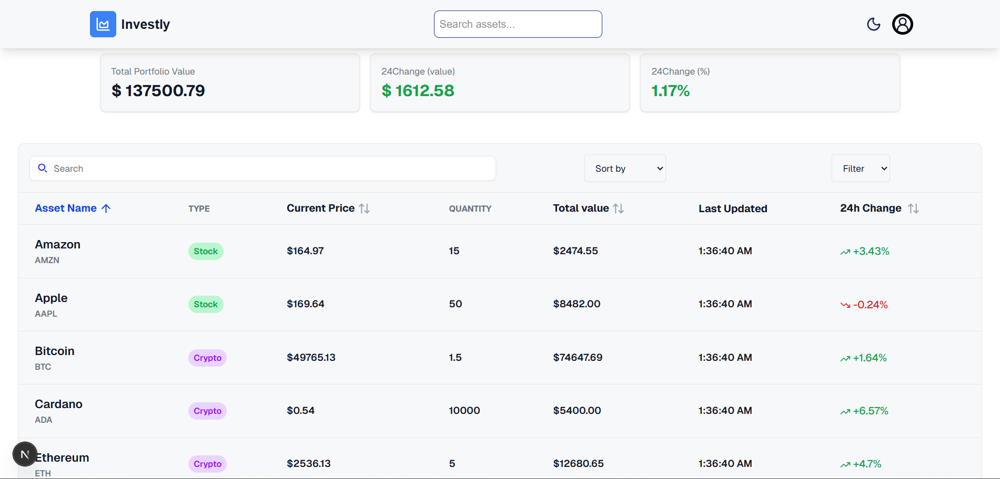
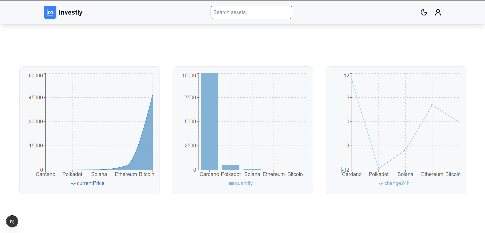
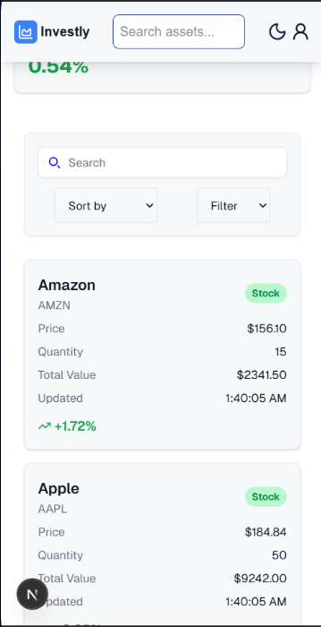
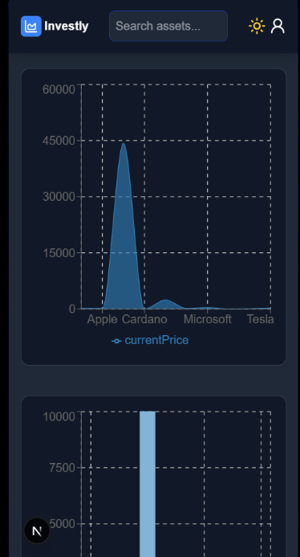

# 📊 Investly

**Investly** is a modern investment dashboard built with **Next.js** that provides real-time asset tracking, analytics, and data visualization for stocks and cryptocurrencies.

The project focuses on clean architecture, performance, and a responsive user experience across all screen sizes.

---

## ✨ Features

- 📈 **Real-time asset simulation** (price updates)
- 🔍 **Debounced global search** for assets
- 🧠 **Advanced filtering & sorting**
- 🌗 **Dark / Light mode**
- 📊 **Analytics dashboard** with:
  - Area Chart
  - Line Chart
  - Bar Chart
- 📱 **Fully responsive UI**
  - Table layout on desktop
  - Card layout on small screens
- 🧩 **Global state management using React Context**
- ⚡ **Optimized calculations with `useMemo`**
- 🎞️ Smooth animations using **Framer Motion**

---
### Screenshots

## 🖥 Dashboard



## 📊 Analytics



## 📱 Mobile View





---
## 🛠️ Tech Stack

- **Next.js (App Router)**
- **React**
- **TypeScript**
- **Tailwind CSS**
- **Recharts**
- **Framer Motion**
- **Lucide Icons**

---

## 🧱 Project Structure

```bash

src/
├── app/
│ └── analytics/
├── components/
│ ├── ui/
│ ├── charts/
│ └── common/
├── context/
│ ├── DataContext.tsx
│ ├── ThemeContext.tsx
│ └── SearchContext.tsx
├── hooks/
│ ├── useData.ts
│ ├── useDebounce.ts
│ ├── useFilter.ts
│ ├── useTheme.ts
│ └── useSort.ts
├── data/
│ └── mockData.ts
└── types/
└── asset.ts
```

---

## 📊 Analytics Page

The Analytics page includes interactive charts powered by **Recharts**:

- **Area Chart** → Tracks asset price trends
- **Pie Chart** → Visualizes asset distribution

Charts are fully connected to the global data context and update dynamically.

---

## 🚀 Getting Started

### 1️⃣ Clone the repository
```bash
git clone https://github.com/cheetah-10/investly.git
```


### 2️⃣ Install dependencies
```bash
npm install
```
### 3️⃣ Run the development server
```bash
npm run dev
```

👉 Open http://localhost:3000 to view the app.

### 🧠 Architecture Notes

- Business logic is extracted into custom hooks

- UI components are kept clean and reusable

- Contexts are separated by responsibility

- Heavy calculations are memoized for performance

### 📌 Future Improvements

- 🔐 Authentication

- 🌍 Real API integration

- 📉 More chart types

- ⭐ Watchlist & favorites

- 🧪 Unit & integration tests

### 👩‍💻 Author

## Menna Shehata
- Front-End Developer (React / Next.js)
- GitHub: [github.com/cheetah-10]